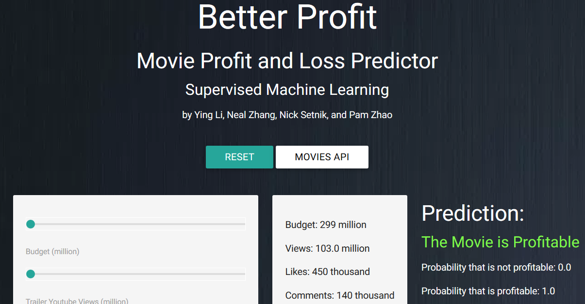
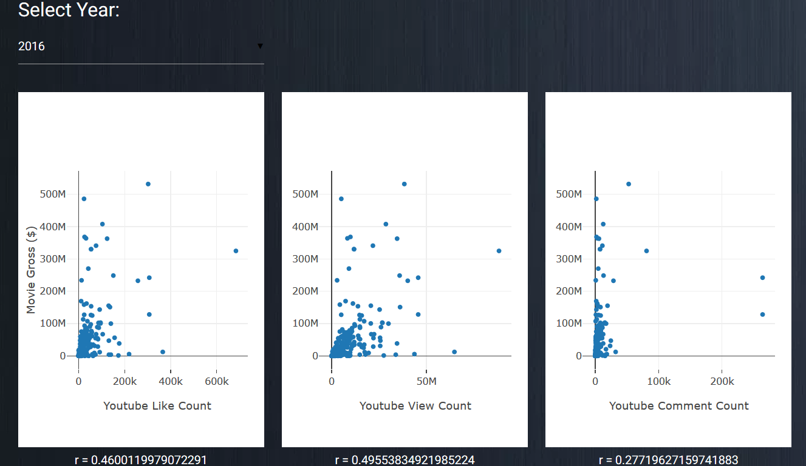
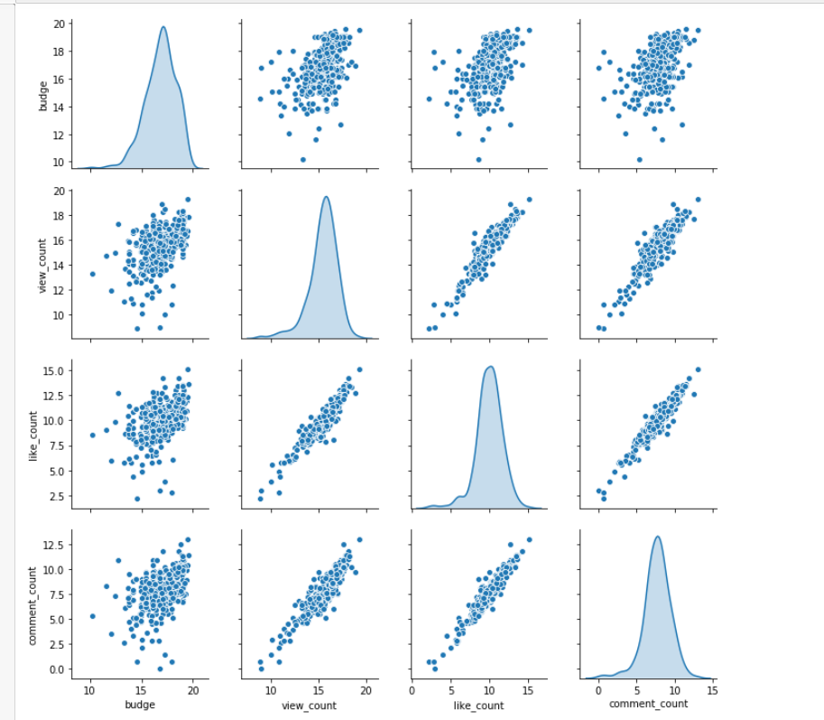

#BETTER PROFIT

## Better Profit 
Upcoming movies are widely popularized by their trailers posted on Youtube. Thus, Youtube metrices (e.g., likes, views, comments) may be important in gaining strategic insights about how well the movie performs in the box office (worldwide). 

We collected movie budget and gross by web scraping, used Youtube API to gather metrics for movies in 2016, 2017, & 2018, and combined these data (555 unique rows) that was used to train and test a classification-based machine learning model with ~70% accuracy. 

With our classification model, we built an app that allows users to interact with specific parameters (budget, Youtube likes, etc) to generate the prediction of the movie as well as observing our dataset with interactive correlation graphs and regression analysis. 

The prediction output is based on the probability where "not profitable" means the movie budget exceeds its gross and "profitable" means the movie budget is less than its gross. 

Enjoy! 

## App 
- Check out our live app here: [Live App](http://bettr-profit-fixed.herokuapp.com/) **Updated to include worldwide movie gross 

#Original Data distribution:

#Log Transformed Data Distribution

## Workflow
- Web scraping using BeautifulSoup to collect movie budget and worldwide gross 
- Youtube API requests to collect metrics of each movie trailer 
- Pandas to clean and combine the data as a CSV file
- Classification model (movie_model_trained.h5) with ~70% accuracy compared to ML model with no result
- Flask app where a user 1) creates their own movie gross prediction using sliders 2) find regression analysis of our dataset (plotly)

## Limitations/Improvements
- Additional factors are needed for the ML model to perform machine learning predictions, which is why we are limited to classification
- Dataset does not follow a normalized distribution and have outliers; thus, we scaled the model

## Resources 
- [Movie Budgets](https://www.the-numbers.com/movie/budgets)
- [Youtube API](https://developers.google.com/youtube/]) 

## Authors 
Nick Setnik, Ying Li, Pamela Zhao, Neal Zheng

## Test Data Accuracy improve from 65% to 83%

 
